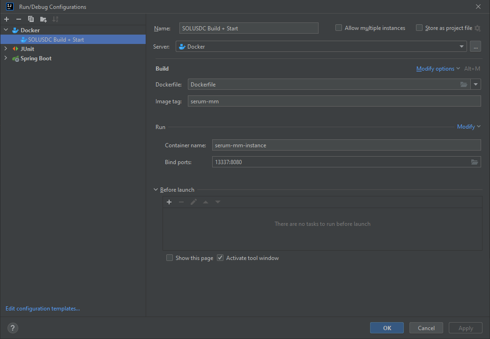

# Setup Guide

Requirements:
- Docker Desktop (for Windows)
- Your private key in a JSON file (sensitive)
- RPC URL (paid provider)
- Data RPC URL (paid provider, can be same as above)
- Open Orders Accounts configured in code

Installation Steps:
1. Set env variables API_KEY and SPRING_PROFILES_ACTIVE to devnet if you want devnet.
2. Update openbook[-devnet].properties to your properties.
1. Docker build the image
2. Run the image

3. Profit

Tested RPC Providers:
1. Quicknode (Two $60 plans)